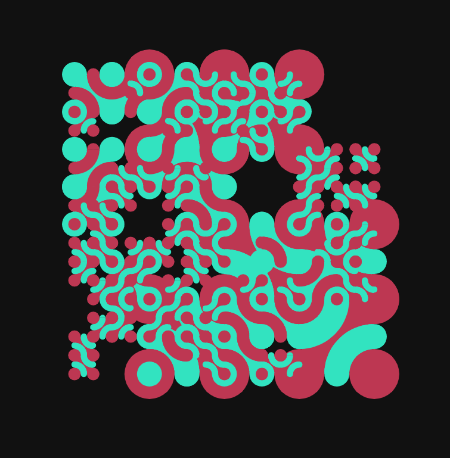

100 Shirts, Burning
===

Example
---

[](https://github.com/abetusk/iao/tree/main/100-shirts-burning_iteration-0)

Quick Start
---

```
python3 -m http.server
```

```
chromium 'http://localhost:8000'
```

Short Statement
---

"100 Shirts, Burning" is an experimental generative art piece that attempts to highlight some of the inherent contradictions surrounding the discussion of non-fungible tokens (NFTs) and its place as a vehicle for artistic creation, artistic expression and the potential of remuneration for artists.

Controls:

a - toggle animation

, - slow down animation

. - speed up animation

s - take screenshot

To the extent possible, the source code is dedicated to the public domain (CC0) and can be used for any purpose, even commercial, by anyone.

This work is heavily based on art available from leading on-demand apparel sites that allow for on-demand printing. Ordering even one shirt from an on-demand printing site exceeds the carbon emissions and the energy requirements to mint a single NFT.

This work hopes to add to the conversation about examining the reality of the ecosystem that we've developed around digital goods and intellectual property.

Tags
---

minimal, geometric, concept, futuristic, background, texture, recursive, shapes, truchet, tile, multi-scale, generative

Statement
---

"100 Shirts, Burning" is an experimental generative art piece that
attempts to highlight some of the inherent contradictions
surrounding the discussion of non-fungible tokens (NFTs) and
its place as a vehicle for artistic creation, artistic expression
and the potential of remuneration for artists.

To the extent possible, the source code is dedicated to the public
domain (CC0) and can be used for any purpose, even commercial, by anyone.

This work is heavily based on art available from leading on-demand
apparel sites, like RedBubble and Core77, that allow for on-demand printing.
Ordering even one shirt from an on-demand printing site exceeds the carbon
emissions and the energy requirements to mint a single NFT ([see](https://web.archive.org/web/20220110140514/https://twitter.com/Supernova_Style/status/1459045172420005888)).

In the USA and Europe, owned clothing can go largely unused.
Often quantities of clothing can end up in landfills.
The energy costs and environmental impact required for minting an NFT
are less than ordering a single piece of clothing from an on-demand
printing organization.

NFTs are condemned for their disastrous environmental
impact while ordering from on-demand printing organizations are normalized or
even championed as giving artists a stream of revenue.
Calls to "fund artists" are sounded but
when it's being funded by NFTs, there is vitriol
directed at artists and participants in the NFT
space.

Many times garments with pictures, similar to
ones generated by this code, can incur costs of $30
or more to the consumer, with hidden costs related to
shipping, manufacture and disposal of the garments produced.

Why are on-demand printing sites valuable while artists creating
NFTs are not?

I don't know if "100 Shirts, Burned"
is worth anything nor do I know if NFTs are
a worthwhile idea but perhaps we can start
to have a conversation that isn't a continuous
stream of incredulous dismissals and start to examine
the reality of the ecosystem that we've developed
around digital goods and intellectual property.

Reference
---

* [RedBubble: wamuigaworld](https://www.redbubble.com/i/t-shirt/Minimalism-Truchet-Patterns-Generative-art-by-wamuigaworld/94064688.WFLAH)
* [Truchet Tiles](https://en.wikipedia.org/wiki/Truchet_tiles)
* [Multi-Scale Truchet Patterns by Christopher Carlson](https://archive.bridgesmathart.org/2018/bridges2018-39.pdf)

License
---

See the file [clipper.js](clipper.js) for its various licensing and copyright information.

All other source code and other assets in this directory are, to the extent possible, licensed
under [CC0](https://creativecommons.org/publicdomain/zero/1.0/).

.
