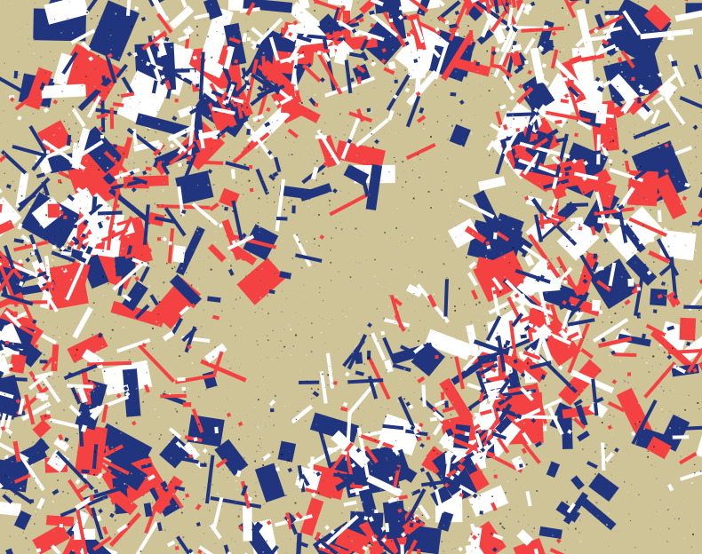

3SUM Economy
===

[](https://github.com/abetusk/iao/tree/main/3sum-economy)

(not) Available on [fxhash](https://www.fxhash.xyz/generative/slug/PROJECT)

Quick Start
---

```
python3 -m http.server
```

```
chromium 'http://localhost:8000'
```

Short Statement
---

"3SUM Economy" is an experimental generative art piece that attempts to highlight some of the inherent contradictions surrounding the discussion of non-fungible tokens (NFTs) and its place as a vehicle for artistic creation, artistic expression and the potential of remuneration for artists.

p - pause

s - screenshot

To the extent possible, source code is dedicated to the public domain (CC0). All third party libraries used are libre/free licensed. Please see individual source files for their license information.

"3SUM Economy" is an attempt to examine on the common criticisms against cryptocurrencies and NFTs that are mired in a "zero sum" mindset.  Cryptocurrencies and NFTs are accused of being incapable of creating wealth and utility while the utility of analogous systems are normalized and criticisms dismissed.

This work hopes to add to the conversation about examining the reality of the ecosystem that we've developed around digital goods and intellectual property.

Tags
---

minimal, generative, rectangles, shapes

Statement
---

"3SUM Economy" is an experimental generative art piece that
attempts to highlight some of the inherent contradictions
surrounding the discussion of non-fungible tokens (NFTs) and
its place as a vehicle for artistic creation, artistic expression
and the potential of remuneration for artists.

To the extent possible, the source code is dedicated to the public
domain (CC0) and can be used for any purpose, even commercial, by anyone.
All third party libraries used are libre/free licensed.
Please see individual source files for their license information.

"3SUM Economy" is an attempt to examine a common argument that NFTs, and cryptocurrencies
in general, are Ponzi schemes or multi-level marketing schemes.
The basic argument is that cryptocurrencies, and by extension NFTs,
cannot create or destroy wealth and so are solely reliant on
external funds to be funneled in.

This basic argument relies on so-called "zero sum" thinking,
where they believe wealth, money and resources in general, are
a limited resource or a conserved quantity.
Proponents of this argument never really address how currencies
in other settings create wealth or are otherwise immune from
the arguments levied against cryptocurrencies.

Currencies, in general, are a social construct that is held together by
the shared belief of value.
The value of any representation of wealth, be it an IOU or a digital
record of wealth, is what we agree it to have.

NFTs are a burgeoning technology and the implications are being
worked out as people use it and experiment with it.
New economies are being created or enhanced by the ability
of artists to create work and be paid for it.
Any valid argument against NFTs has to consider whether the
points against it are substantially different from any new
form of payment processing or other system that enables economic
trade.

Is PayPal generating wealth, either by enabling people
to facilitate online economic activity or otherwise?
Why is PayPal immune to this criticism while cryptocurrencies
and the economies growing around it are susceptible?

I don't know if "3SUM Economy"
is worth anything nor do I know if NFTs are
a worthwhile idea but perhaps we can start
to have a conversation that isn't a continuous
stream of incredulous dismissals and start to examine
the reality of the ecosystem that we've developed
around digital goods and intellectual property.

Reference
---

* [Chromotome](https://github.com/kgolid/chromotome)
* [Bezier.js](https://github.com/Pomax/bezierjs)
* [Perlin](https://github.com/josephg/noisejs)

License
---

All third party libraries used are libre/free licensed.
Please see individual source files for their license information.

All other source code and other assets in this directory are, to the extent possible, licensed
under [CC0](https://creativecommons.org/publicdomain/zero/1.0/).

.
