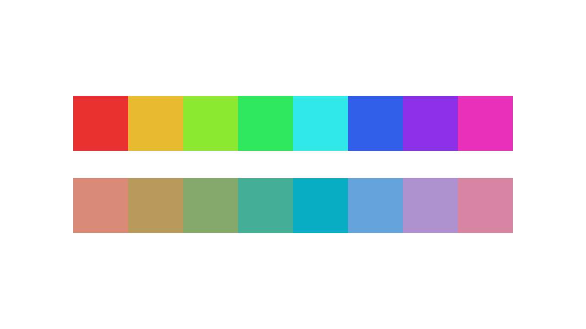
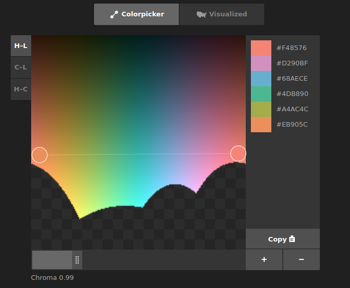

Notes
===

Notes on ideas and resources for generative art.

General
---

* [Bridges Conference Archive](https://archive.bridgesmathart.org/)
* [Generated Space](https://generated.space/)
* [Tyler Hobbs - Essays](https://tylerxhobbs.com/essays)
* [Decon Batch](https://www.deconbatch.com/)
* [How to Make Generative Art Feel Natural](https://www.generativehut.com/post/how-to-make-generative-art-feel-natural)
* [Morphogenesis Resources](https://github.com/jasonwebb/morphogenesis-resources)
* [Gorilla Sun](https://gorillasun.de/posts/)


Libraries
---

* [josephg/noisejs - Perlin and simple noise JS library](https://github.com/josephg/noisejs)
* [gka/chroma.js](https://github.com/gka/chroma.js)
* [Chromotome](https://kgolid.github.io/chromotome-site/)
* [neilpanchal/Chroma](https://github.com/neilpanchal/Chroma)

Palette
---

* [Minimal Color Swatches - blog post](https://hugodaniel.com/posts/minimal-color-swatches/)
* [How to Avoid Equidistant HSV Colors - blog post](https://www.vis4.net/blog/2011/12/avoid-equidistant-hsv-colors/)
* [i want hue - interactive tool](https://medialab.github.io/iwanthue/)
* [color pickter - interactive tool](http://tristen.ca/hcl-picker) ([src](https://github.com/tristen/hcl-picker/))
* [Inigo Quilez (phase shifting)](https://iquilezles.org/articles/palettes/)
* [ofxSwatch](https://github.com/sam-tsao/ofxSwatch) ([medium](https://sam-tsao.medium.com/3-levels-of-generative-colors-b43bd0d6d609))
* [muesli/gamut](https://github.com/muesli/gamut)
* [r-color-palettes](https://github.com/EmilHvitfeldt/r-color-palettes)

Concepts
---

* [Flow Fields - Tyler Hobbs](https://tylerxhobbs.com/essays/2020/flow-fields)
* [Chaikin's Algorithm](https://observablehq.com/@pamacha/chaikins-algorithm)
* [Halton Sequence](https://en.wikipedia.org/wiki/Halton_sequence)
* [Poisson-Disc Sampling](https://www.jasondavies.com/poisson-disc/)
  - [Poisson Disk](https://www.cs.ubc.ca/~rbridson/docs/bridson-siggraph07-poissondisk.pdf)
* [Quasi-Random Sequences](http://extremelearning.com.au/unreasonable-effectiveness-of-quasirandom-sequences/)

Ideas
---

* Have patterns at multiple scales
  - Large/low complexity  patterns offer visual anchors for other areas of higher complexity
  - Hierarchical grids are a good example
  - Hierarchical grids offer independence of each recursive area
  - Multiscale Truchet patterns offer another with a way of negotiating the interface between
    scales
* Simple patterns can have highlights to help add interest and highlight the pattern
  - drop shadows
  - lighter highlights and darker shading in regions to simulate position lighting
  - gradient as a 'faux' lighting effect
  - variation in line density or position variability to simulate strokes
  - addition of texture noise to give more visual interest
* Use the blend/alpha channel to soften lines, points and objects
* Use CIE-LCH or similar colorspace if using color
  - Alternatively use pre-specified color palettes
* Try to incorporate movement
* Provide textured noise to flat spaces to give visual interest
  - could be uniform noise in background


Discussion
---

### Techniques


* Flow fields
* Circle Packing
* Voroni diagrams 
* Flocking techniques 
* Cellular Automata
* Noise algorithms 
* Brownian motion
* GAN
* Raymarching 
* L-tree systems
* Physarum simulation
* Fractal systems
* Asemic Writing
* Recursive subdivision
* Wave Function Collapse
* Markov Chains

### Color

One of the reasons why choosing random hues from HSV space is so bad is because
the different colors have different brightness intensities.

The following example ([from here](https://github.com/neilpanchal/Chroma)) is illustrative:



The CIE-Lab attempts to fix this by normalizing on brightness/lightness.
The CIE-LCH tries to make the CIE-Lab a little more programmer friendly by converting to cylindrical
coordinates but I guess care still needs to be taken as there are 'blank' regions where
there is no corresponding color.

Here is an example layout ([from here](https://tristen.ca/hcl-picker/#/hlc/6/0.99/21313E/EFEE6A)):




### Noise

#### Random Points on a Disc

A naive implementation of choosing noise in a disc will look as follows:

```
function disc_noise(cx,cy,R,N) {
  for (let i=0; i<N; i++) {
    let r = Math.random()*R;
    let a = Math.random()*Math.PI*2;
    let x = cx + r*Math.cos(a);
    let y = cx + r*Math.cos(a);
    plot_point(x,y);
  }
}
```

This will "prefer" center points as the area in the center is smaller than the corresponding annulus on
the periphery.

Instead, a `sqrt` factor needs to be introduced:

```
function disc_noise(cx,cy,R,N) {
  let c = 0.5;
  for (let i=0; i<N; i++) {
    let r = Math.pow(Math.random(),c)*R;
    let a = Math.random()*Math.PI*2;
    let x = cx + r*Math.cos(a);
    let y = cx + r*Math.cos(a);
    plot_point(x,y);
  }
}
```

([see](https://mathworld.wolfram.com/DiskPointPicking.html))

#### Perlin Noise

I think one can construct this by taking noise curves at different
scales and weighting their amplitude differently.

For example, summing curves with power of two random frequencies and inversely
weighting the amplitude.

* [Perlin Noise](https://en.wikipedia.org/wiki/Perlin_noise)

#### Simplex Noise

* [Simplex Noise](https://en.wikipedia.org/wiki/Simplex_noise)

#### Worley Noise

* [Worley Noise](https://en.wikipedia.org/wiki/Worley_noise)


