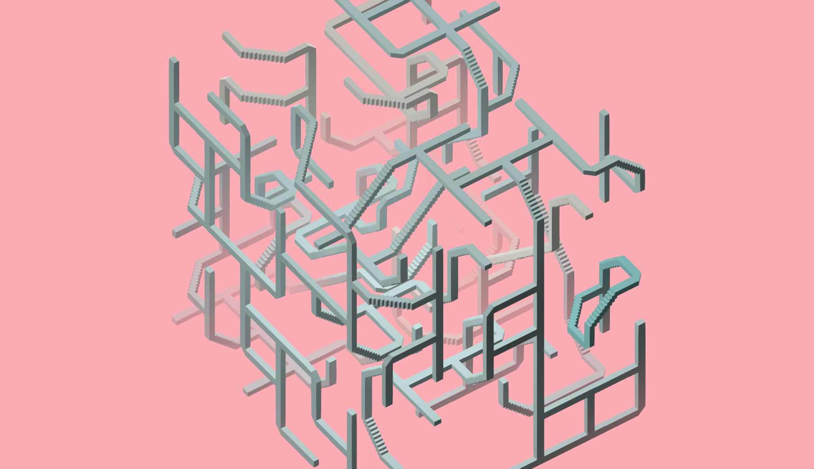
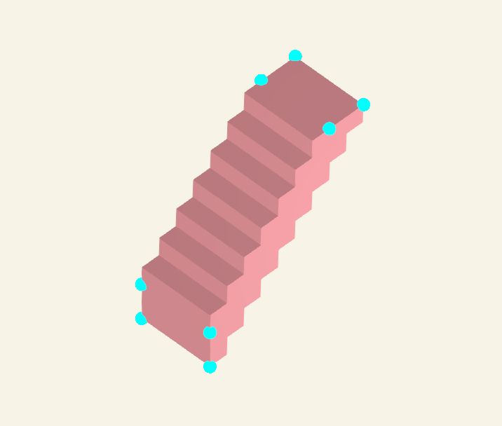

Lessons Learned from Implementing "Wave Function Collapse"
===


In the project "Like Go Up", a version
of \[mxgmn\]'s "Wave Function Collapse" (WFC)
algorithm was implemented to create 3D winding stair and
platform like structures.

This article is a description of some lessons learned from
implementing a "Wave Function Collapse" (WFC) like algorithm.
The aim is to provide a review of
how the algorithm works and what some pitfalls were.


This article will go more in depth but as an overview,
here are the succinct lessons learned:

* "Wave Function Collapse" works best with "simple" neighboring tiles
  and interactions. Anything beyond this assumption leads to an over complicated
  implementation.
* Tilesets need to be conditioned to have enough degrees of freedom. An overly
  constrained tileset will lead to failures in finding viable solutions.
* Optimizations that update only required elements, though straight forward and
  obvious, are necessary for appropriate execution speed

Review
---



"Wave Function Collapse" (WFC) is a [generative art tool by
project](https://github.com/mxgmn/WaveFunctionCollapse) by \[mxgmn\].
From the project site, "Wave Function Collapse" (WFC) is a:

> Bitmap & tilemap generation from a single example with the help of ideas from quantum mechanics

Note that the reference to quantum mechanics is an homage, as \[mxgmn\] writes:

> ... it doesn't do the actual quantum mechanics, but it was inspired by QM


The implementation that will be discussed in this article is more of
a "Wave Function Collapse" (WFC) inspired algorithm as it doesn't take
any input image or scene.
Instead, it uses a constructed 3D tileset to create
3D structures using a type of constraint propagation and
chooses candidate tile positions to collapse via entropy minimization.

Briefly, this means for any state of the system,
entries are removed if their presence would create a contradiction.
Once all contradictions are removed, a candidate tile is chosen
based on how "constrained" it is.

The forced removal of tiles is called the "constraint propagation" phase.
The choice of a constrained tile to make progress is called the
collapse via entropy minimization.

Each of these steps and terms will be discussed later in the article.


Tilemap Setup
---

The library of 3D tiles consists, conceptually, of 8 different types of tiles:

| Name | Description  | Picture |
|------|--------------|---------|
| `.`  | Blank/Empty  | empty grid |
| `\|`  | Road         |  |
| `+`  | Cross        |  |
| `T`  | T            |   |
| `r`  | Bend         |  |
| `^`  | Stair        |  |
| `p`  | Dead End     |  |

From the "base" tiles, the triangle display geometry is calculated and a set of "endpoints" is
created as an indication of how it can be attached to other tiles in the library.


Each tile that can connect to another has a grouping of 4 points on each edge that it can
connect out of.
These points are flush in the plane they sit on at the edge of a zero centered 1 unit width cube.



A complete "raw" library of endpoint rotations is constructed by rotating each base
tile by 90 degree increments in each of the major axies, `X`, `Y` and `Z`.


By comparing the endpoints with either a rotated version of itself or with other rotated tiles,
identical tiles can be identified and neighboring tiles can be identified.

From the duplicated list of tiles, a representative is chosen to be the representative of
the different rotated versions.

For example, the "cross", if it lies flat in the `XY` plane, is identical to a "cross" that
is rotated by 90 degrees around the `Z` axis.
In this case, the tile `+000` is kept and used as the representative as `+001`, `+002` and
`+003` are all identical to it.


For each representative tile, a map of admissible neighbors is created that stores information about what tiles can be placed
next to each other and whether they are connected or not.
The only neighbor positions allowed are in increments of `+/-1` in each of the major axies (`X`, `Y`, `Z`),
excluding diagonals.

Tiles that cannot be next to each other are not in the admissible map.
Tiles that are in the admissible map also have an indication of whether they are connected or
disconnected.


 
For example, a `T` tile that has connection points `[-1,0,0], [1,0,0], [0,-1,0]` (in `[x,y,z]` coordinates)
would not have a bend above it in the `[0,1,0]` direction if the bend tile that had connection points `[0,-1,0], [1,0,0]`.
For the above `T` tile, there would be an admissible blank tile (`.`) in the `[0,1,0]` position with an indication that
they are disconnected and there would also be an admissible road tile (`|`) to the bottom of it at `[0,-1,0]` for a suitably
oriented road tile.

After the representative tiles are chose, the display geometry is created by rotating the
triangle geometry for the canonical tile.

The endpoint representation and programmatic rotation allows for a semi-automated creation of
the tileset.
Additional tiles can be added by only adding the canonical tile geometry and endpoints,
without the need to add the profusion of pairwise interactions that would result.

Note that the blank tile (`.`) is explicitly included in the admissible map.
This means it is an error if any grid cell has all entries removed as the "empty" cell is explicitly
represented by a tile.


Wave Function Collapse Algorithm
---


Once the tilemap has been constructed, we the wave function collapse algorithm
can be run in earnest.

A cell grid is created that has each tile possibility at every cell position.
The "wave function collapse" (WFC) algorithm proceeds to remove tile possibilities at any
cell grid position it can until it runs out of choices.

When the WFC algorithm can't make any more progress propagating forced implications, it
chooses a random cell, based on an entropy measure, and chooses ("collapses") a single tile for that
cell.

After the tile is chosen for a cell, the cell and it's neighbors are marked for further processing.
Flagging the processed cell and its neighbors is
an optimization to focus on only cells that have the potential to change instead of
wasting effort considering cells that are known to not need updating.

Here is the pseudo-code to the algorithm:

```javascript
function WaveFunctionCollapse(grid) {

  initialCull(grid);
  propagateGridAll(grid);

  while (true) {

    clearTileFlags(grid);

    r = collapseSingleTile(grid);

    accessedGridPositions = {};
    flagGridNeighbors(grid, accessedGridPositions, r.collapsedPosition);

    r = propagateGrid(grid, accessedGridPositions);
    if (r.state == "finished") { return; }

  }

}
```

The bulk of the "wave function collapse" algorithm earmarks a single tile in
a cell position to keep, then propagates the implications of choosing that tile
by removing all other tiles that can never be chosen.

The `initialCull` is called to mark tiles that are invalid from the beginning, such
as tiles on the boundary whose connection points fall out of bounds.
The `propagateGridAll` is an unoptimized version of the `propagateGrid` function,
described below, that processes all grid points without restricting to only
'marked' positions stored in `accessedGridPositions`.

::collapse

Possible tiles are removed from the grid positions when they're culled
from the `collapseSingleTile` and `propagateGrid` functions, using the
`accessedGridPositions` structure to indicate which grid positions
are to be processed.

The `accessedGridPositions` is the structure that allows the optimization
of only updating cell positions that need it, rather than doing a full
sweep over the whole grid.

The psuedo-code for `collapseSingleTile`:

```javascript
function collapseSingleTile(grid) {
  let minEntropy = -1;
  let minCell = null;
  for (let gridCell in grid) {

    // skip already processed cell positions
    if (gridCell.length==1) { continue; }

    for (let tile in gridCell) {
      tileProbability = pdf(tile);
      cellEntropy += tileProbability * Math.log(tileProbability);
    }
    if ((minEntropy < 0) ||
        (cellEntropy < minEntropy)) {
      minEntropy = cellEntropy;
      minCell = gridCell;
    }
    
  }

  let chosenTile = pdfRandomChoice(pdf, minCell);
  minCell = [ chosenTile ];

  return { "collapsedPosition": minCell };
}
```

Most of the complexity of the `collapseSingleTile` function comes
with calculating the entropy for tiles that have different probabilities
which are encapsulated in the `pdf` (probability distribution function).
The `pdfRandomChoice` is meant to choose a tile in a given cell
with the probability or weight for any given tile.

Finally, the `propagateGrid` function propagates tiles in
cells that are flagged for review if they aren't admissible.

::propagate

The test for each tile in each cell is:

* If it has a connection that goes out of bounds, it should be culled
* If it doesn't have a valid neighbor somewhere next to it, it should be culled

Where a "valid neighbor" means either a neighbor that exists next to the
tile in question, be it connected or no.
An "invalid" neighbor is one where a connection is present
in one tile but not in the other.
For example, a "road" tile (`|`) that feeds into an empty tile (`.`)
is invalid as the road expects a connection point where none exists
for the empty tile.

The psuedo-code for `propagateGrid` is as follows:


```javascript
function propagateGrid(grid, accessedGridPositions) {

  let culling = true;
  let updatedAccessedGridPositions = accessedGridPositions;

  while (culling) {
    culling = false;

    removeFlaggedTiles(grid);
    accessedGridPositions = updatedAccessedGridPositions;

    for (let anchorCell in accessedGridPositions) {

      for (let anchorTile in anchorCell) {

        let neighborCells = getNeighbors(grid, anchorCell);
        for (neighborCell in neighborCells) {

          if (outOfBounds(neighborCell)) {
            if ( hasOutgoingConnection(anchorTile, neighborCell) ) {
              culling = true;
              anchorTile.valid = false;
              flagGridNeighbors(grid, updatedAccessedGridPositions, anchorCell);
              break;
            }
            continue;
          }

          if ( ! hasAtLeastOneAdmissibleNeighbor(anchorCell, neighborCell) ) {
            culling = true;
            anchorTile.valid = false;
            flagGridNeighbors(grid, updatedAccessedGridPositions, anchorCell);
            break;
          }

        }
        if (culling) { break; }

      }
      if (culling) { break; }

    }
  }

  if (collapsedState(grid)) { return { "state" : "finished" }; }
  return {"state": "processing" };

}
```

Some notable points:

* Anytime a tile gets culled, the cell and all of it's valid neighbors need to be reprocessed
* The `outOfBounds` check can be altered to contain wrap around conditions if desired

The above pseudo-code is meant more for illustrative purposes.
An implementation of the above code would need to check for errors to see if it fails to find a realization
by removing all potential possibilities in a cell position, say.


Lessons Learned
---

In experimenting with implementing a "wave function collapse" inspired algorithm,
I fell into many pitfalls when creating the tile library and resulting implementation.

#### Pitfall #1, Privileging the Empty Tile

Initially, I did not explicitly treat an "empty" tile (`.`) as a regular tile.
This led to increased code complexity because of the empty tile's privileged status.

When scanning for admissible neighbors, I would have to skip some tiles if they
were the empty tile or do special case branching to handle the empty tile.

Instead, adding the empty tile to the admissible map and allowing it to be checked just
as any other tile would be meant the special cases to consider the empty tile disappeared.

#### Pitfall #2, Complicated Tile Connections


The "wave function collapse" (WFC) like algorithm is conceptually simpler when
tile neighbor tests can be treated in a homogeneous way.

This means not having special case neighbor tests for some tiles and treating
every tile as if it can test for valid tiles next to it by considering a
simple neighborhood around the position in question.
One of the simplest ways to do this is to consider six cell positions 
in each `[+1,-1]` direction along the major axies.

Without this simplifying assumption, the code to find out which tiles
are admissible neighbors to each other, which tiles should be culled,
which tiles have no connections out of it or into it, or any of the
myriad of other tests, quickly become overly complex.

#### Pitfall #3, Overly Constrained Tilemap


The initial tileset used didn't have a "dead-end" tile (`p`) and
for many of the test runs, this resulted in failed realizations.

For small grid sizes, the realization would sometimes succeed,
but as the grid sizes increased, the chances of finding a valid
realization quickly diminished.

The issue, I suspect, is that without the "dead-end" (`p`) tile to
allow for a chain of choices to easily be valid, a partial
realization could easily get into a state where local consistency
was achieved but a global or further reaching contradiction was
either present or highly probable.

An enlightening example is in a `4x4x1` grid.
Intuitively, only tiles "in plane" are the most likely.
That is, tiles that are flat in the `XY` plane should
be the most likely to be chosen for most realizations.


If a "stair" (`^`) tile is ever chosen, this drastically
restricts the potential tiles available for any valid
realization.
Now, not only do the tiles chosen need
to be either "road" (`|`) tiles or other stair tiles (`^`)
in the `XZ` or `YZ` directions, it also needs to loop
back in on itself.

The algorithm will start
choosing other tiles that are locally consistent.
Each choice that isn't considerate of the initial
"stair" tile will further reduce the chance of
choosing an appropriately oriented tile to connect.

One fix is to add tiles that allow more freedom
of choice for any particular cell.
In this case, adding the "dead end" (`p`) tile
allows WFC to "patch up" a section that might
have otherwise resulted in a contradiction.

An interesting question is what a good test is,
even if it's a heuristic, to determine when tiles
are overly constrained.
It would also be interesting to determine at what
threshold of size or grid structure any particular
tileset starts to have issues converging in on
a valid realization.

#### Pitfall #4, Not Optimizing


The consensus is "get it working, then get it to working fast",
also known as "premature optimization is the root of all evil"
Unfortunately, even moderately sized grids become
unwieldy without optimization, so optimization is
necessary very quickly.

Just from the initial setup of the problem, each cell needs to be visited
at least once because it needs to be collapsed into a definite state.
This gives already an $O(n)$ run-time, where $n$ is the number of cells of the grid.
If the whole grid needs to be examined every update, this
gives an $O(n^2)$ which grows quickly, especially
when uniformly increasing each dimension of the grid.

Though it's difficult to say what the estimated run time is without
some intricate knowledge of tile interactions, either for this
setup or others, one can imagine a constant update time after each
cell position is collapsed, recovering an $O(n)$ runtime.


Conclusion
---


\[mxgmn\]'s "Wave Function Collapse" (WFC) algorithm is both
an accessible framework to more theoretical
ideas of constraint satisfaction problems but also
conceptually simple and powerful that allows rich
outputs from minimal effort.

The main drawbacks of it's inability to overcome local consistency
at the sacrifice of further reaching cohesion are issues that grieve
many adjacent classes of problems and algorithms in this space.
Constraint satisfaction, as a general problem, is $\text{NP-Complete}$
so we have no hope of ever finding efficient algorithms.
It would be interesting to pursue other heuristics to see
if they can't keep the same ease and versatility in their
use while providing more powerful tools.


References
---

* mxgmn (2022) WaveFunctionCollapse \[Source code\] [github.com/mxgmn/WaveFunctionCollapse](https://github.com/mxgmn/WaveFunctionCollapse)
* kchapelier (2022) wavefunctioncollapse \[Source code\] [github.com/kchapelier/wavefunctioncollapse](https://github.com/kchapelier/wavefunctioncollapse)
* Wikipedia (2022, September) Constraint Satisfaction Problem. [https://en.wikipedia.org/wiki/Constraint_satisfaction_problem](https://en.wikipedia.org/wiki/Constraint_satisfaction_problem)
* Wikipedia (2022, September) NP-Completeness. [https://en.wikipedia.org/wiki/NP-completeness](https://en.wikipedia.org/wiki/NP-completeness)
* 

License
---

All text, code, images and other digital artifacts in this article is licensed under a CC0 license.
