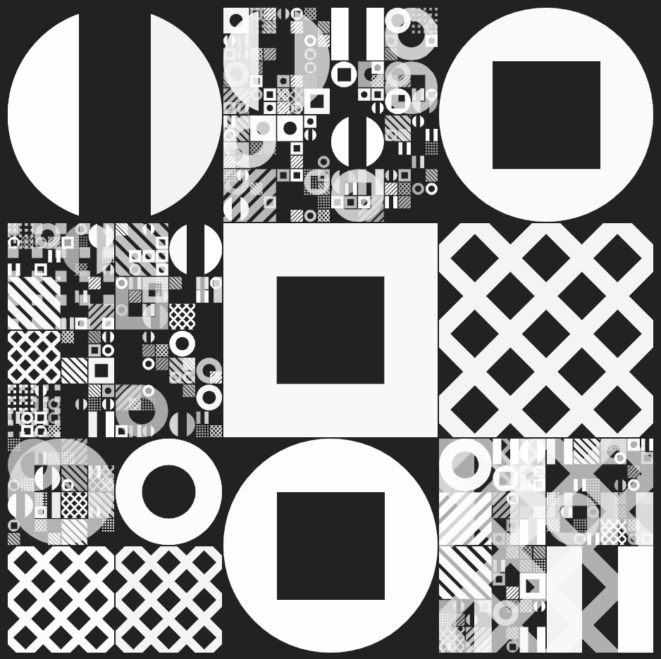

I Stockpile Dreams With Tragedies
===

[](https://github.com/abetusk/iao/tree/main/i-stockpile-dreams-with-tragedies_iteration-0)

Available on [fxhash](https://www.fxhash.xyz/generative/slug/i-stockpile-dreams-with-tragedies).

Quick Start
---

```
python3 -m http.server
```

```
chromium 'http://localhost:8000'
```

Short Statement
---

"I Stockpile Dreams With Tragedies" is an experimental generative art piece that is an attempt to highlight some of the inherent contradictions surrounding the discussion of non-fungible tokens (NFTs) and its place as a vehicle for artistic creation, artistic expression and the potential of remuneration for artists.

To the extent possible, the source code is dedicated to the public domain (CC0) and can be used for any purpose, even commercial, by anyone. Third party libraries are used that are not CC0 licensed but have libre/free licensing terms that allow for commercial reuse (please see the LICENSE section for more details).

This work is heavily based on stock art that is available from pay-to-download sites and other artists that copy the style but don't release the art, or the code to generate it, to the community at large.

This work hopes to add to the conversation about examining the reality of the ecosystem that we've developed around digital goods and intellectual property.

Tags
---

minimal, geometric, concept, cover, cover art, futuristic, background, texture, recursive, shapes

Statement
---

"I Stockpile Dreams With Tragedies"
is an experimental generative art piece
that is an attempt to highlight
some of the inherent contradictions
surrounding the discussion of non-fungible
tokens (NFTs) and its place as a vehicle
for artistic creation, artistic expression
and the potential of remuneration for artists.

To the extent possible,
the source code for
"I Stockpile Dreams With Tragedies"
is dedicated to the public domain (CC0)
and can be used for any purpose, even commercial,
by anyone.
Third party libraries are used that are not CC0
licensed but have libre/free licensing terms
that allow for commercial reuse (please see
the LICENSE section for more details).

Many people dismiss NFTs as having no intrinsic
value, or as absurd because of its
replicability, while at the same overlooking the
ecosystem of stock images on websites that
charge for digital assets or artists that retain
copyright on their images, presumably with the
expectation of charging license fees for their
use.

Often times, art on stock image sites can
incur many of the same criticisms levied
against NFTs as being too simple or not
professional enough.
The criticisms against the quality of NFT
art is used to diminish works in the NFT space while
the quality of stock image art goes largely
unaddressed.

Artists also gain funding from membership
platforms, such as Patreon.
NFTs provide many of the same functions
to artists with respect to the potential
of allowing new supportive revenue streams.
Many people dismiss or diminish the value
of revenue streams from NFTs while
overlooked payments from membership platforms.

Calls to "fund artists" are sounded but
when it's being funded by NFTs, there is vitriol
directed at artists and participants in the NFT
space.

"I Stockpile Dreams With Tragedies" is heavily
based on stock art that is available from
pay-to-download sites and other artists
that copy the style but don't release the
art, or the code to generate it, to the community
at large.

Many times, pictures similar to
ones generated by this code can incur costs of $10
or more, per image.
Many sites offer monthly subscription rates starting
at $50 per year.
Price gouging, restrictive licensing and overly
broad copyright terms are taken as the norm
while technology that experiments with ideas
of uniqueness, value and enabling alternative
income streams is berated.
Why are stock image sites valuable but receiving payments
from NFTs not?

I don't know if "I Stockpile Dreams With Tragedies"
is worth anything nor do I know if NFTs are
a worthwhile idea but perhaps we can start
to have a conversation that isn't a continuous
stream of incredulous dismissals and start to examine
the reality of the ecosystem that we've developed
around digital goods and intellectual property.

Reference
---

* [Dreamstime: Gary Killian](https://www.dreamstime.com/stock-illustration-vector-minimal-covers-procedural-design-futuristic-minimalistic-layout-conceptual-generative-background-journal-vector-minimal-image99452072)
* [iStockPhoto: Gary Killian](https://www.istockphoto.com/vector/vector-minimal-covers-procedural-design-futuristic-minimalistic-layout-conceptual-gm954662046-260653001)
* [Aleksandar Bradic](https://ello.co/randomwalks) ([instagram](https://www.instagram.com/alek/))


License
---

See the file [clipper.js](clipper.js) for its various licensing and copyright information.

All other source code and other assets in this directory are, to the extent possible, licensed
under [CC0](https://creativecommons.org/publicdomain/zero/1.0/).

.
