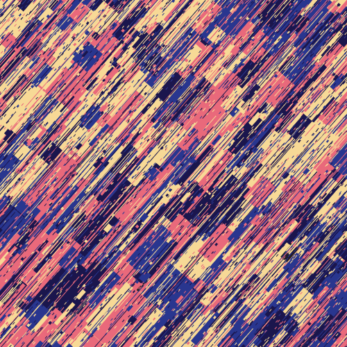

Screenshot Heist
===

[](https://github.com/abetusk/iao/tree/main/screeshot_heist)

Available on [fxhash](https://www.fxhash.xyz/generative/slug/Screenshot Heist)

Quick Start
---

```
python3 -m http.server
```

```
chromium 'http://localhost:8000'
```

Short Statement
---

"Screenshot Heist" is an experimental generative art piece that attempts to highlight some of the inherent contradictions surrounding the discussion of non-fungible tokens (NFTs) and its place as a vehicle for artistic creation, artistic expression and the potential of remuneration for artists.

p - pause

s - screenshot

To the extent possible, source code is dedicated to the public domain (CC0).

"Screenshot Heist" is an attempt to address a common bad faith argument against NFTs that claims the value of an NFT is worthless because taking a "screenshot" of the underlying asset is so easy. Digital property enforcement is commonplace while transactions about on a public blockchain are treated as irrational. Why is legal action to prevent copying normalized while a public record of ownership on a blockchain absurd?

This work hopes to add to the conversation about examining the ecosystem that we've developed around digital goods and intellectual property.

This work is influenced by the artists `01000010`.

---

"Screenshot Heist" is an experimental generative art piece that attempts to highlight some of the inherent contradictions surrounding the discussion of non-fungible tokens (NFTs) and its place as a vehicle for artistic creation, artistic expression and the potential of remuneration for artists.

p - pause

s - screenshot

To the extent possible, source code is dedicated to the public domain (CC0).

"Screenshot Heist" is an attempt to address 
a common bad faith argument against NFTs that claim to render the value
of an NFT worthless because taking a "screenshot" of the underlying asset is so easy.
Digital property enforcement is considered commonplace
while transactions about digital property on a public blockchain
are treated as irrational.
Why is legal action to prevent digital copying normalized while
ownership on a blockchain absurd?

This work hopes to add to the conversation about examining the reality of the ecosystem that we've developed around digital goods and intellectual property.

This work is heavily influenced by the artists `01000010`, also known
as `benkelmann`.

Tags
---

minimal, generative, geometry, rectangles

Statement
---

"Screenshot Heist" is an experimental generative art piece that
attempts to highlight some of the inherent contradictions
surrounding the discussion of non-fungible tokens (NFTs) and
its place as a vehicle for artistic creation, artistic expression
and the potential of remuneration for artists.

To the extent possible, the source code is dedicated to the public
domain (CC0) and can be used for any purpose, even commercial, by anyone.

A common bad faith argument against NFTs is that because it's easy to
create a "screenshot" of the underlying asset, the value of the NFT is
worthless.
"Screenshot Heist" is an attempt to address this critique by highlighting
the absurdity of normalizing the current state of copyright and digital
property ownership while considering ownership through a public decentralized
ledger as irrational.

A difference that digital media has to traditional media is that duplication
is low cost.
Since copying digital media is only a matter of reproducing the digital information,
social constructs, such as copyright law, need to be put in place to police
ownership and theft.
The current state of digital information property enforcement has been normalized
while transactions relating to digital information property on a public blockchain
are treated as irrational.

For example, a limited reproduction run of a photograph can be signed by the original artist
and be purchased with claims of ownership and authenticity, even though the
art is not owned by the purchasing party and the purchased item is a reproduction.
When a limited minting run of an NFT is created, suddenly
it's criticized for not being "real", without any thought as to whether
a copy of a photograph is any more real.

One aspect of the value of any piece of art might be the origin of how it was created
and a certification of who created it.
We've normalized traditional art and reproduction so that we've equated the physical
limitations of duplication, and the physical artifacts that are distributed, with the
authenticity of the piece, even though from a social and legal standpoint, these
are only tangentially related.

I don't know if "Screenshot Heist"
is worth anything nor do I know if NFTs are
a worthwhile idea but perhaps we can start
to have a conversation that isn't a continuous
stream of incredulous dismissals and start to examine
the reality of the ecosystem that we've developed
around digital goods and intellectual property.

This work is heavily influenced by the artists `01000010`, also known
as `benkelmann`.
Please see the `Reference` section for details and other information
on their work.


Reference
---

* [01000010 on versum.xyz](https://versum.xyz/user/tz1MkjnBhAB5y7ZCSVXmwCayZvrWhB3LcUr2) ([@benkelmann](https://twitter.com/benkelmann) [fxhash](https://www.fxhash.xyz/u/01000010))

License
---


All other source code and other assets in this directory are, to the extent possible, licensed
under [CC0](https://creativecommons.org/publicdomain/zero/1.0/).

.


