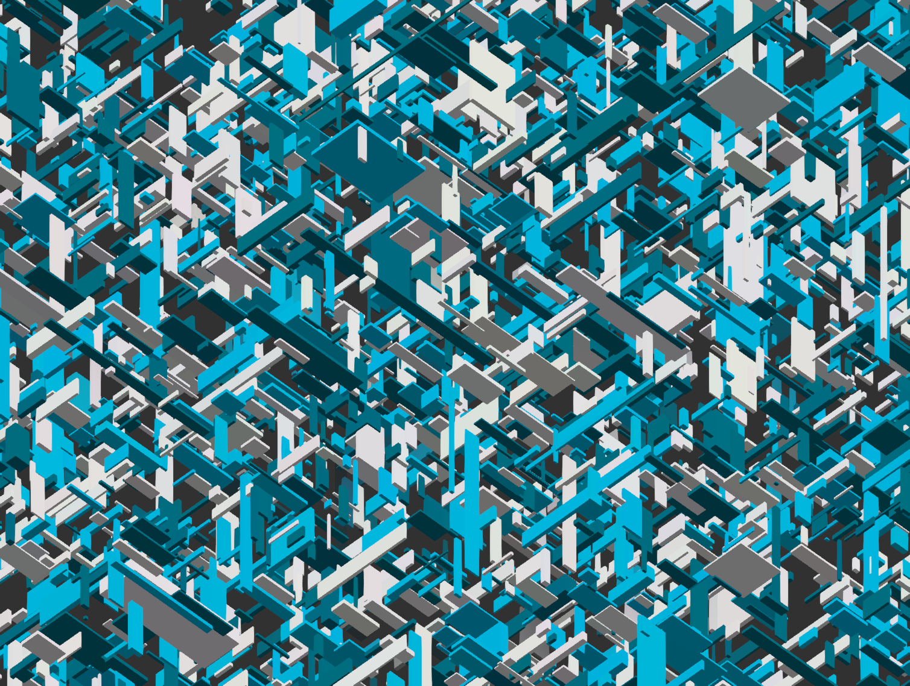

Screenshot Heist : 1Gen
===

[](https://github.com/abetusk/iao/tree/main/screeshot_heist_1gen)

(Not) Available on [fxhash](https://www.fxhash.xyz/slug/...)

Quick Start
---

```
python3 -m http.server
```

```
chromium 'http://localhost:8000'
```

Short Statement
---

"Screenshot Heist : 1Gen" is an experimental generative art piece that attempts to highlight some of the inherent contradictions surrounding the discussion of non-fungible tokens (NFTs) and its place as a vehicle for artistic creation, artistic expression and the potential of remuneration for artists.

p - pause

s - screenshot

a - video capture (5s) (advanced usage)

To the extent possible, the source code is dedicated to the public domain (CC0) and can be used for any purpose, even commercial, by anyone. All third party libraries used are libre/free. Please check individual files for their respective licenses.


A common bad faith argument against NFTs is that because it's easy to create a "screenshot" of the underlying asset, the value of the NFT is worthless.  "Screenshot Heist" is an attempt to address this critique by highlighting the absurdity of normalizing the current state of copyright and digital property ownership while considering ownership through a public decentralized ledger as irrational.

This work hopes to add to the conversation about examining the ecosystem that we've developed around digital goods and intellectual property.

Tags
---

minimal, generative, geometry, rectangles

Statement
---

"Screenshot Heist" is an experimental generative art piece that
attempts to highlight some of the inherent contradictions
surrounding the discussion of non-fungible tokens (NFTs) and
its place as a vehicle for artistic creation, artistic expression
and the potential of remuneration for artists.

A common bad faith argument against NFTs is that because it's easy to
create a "screenshot" of the underlying asset, the value of the NFT is
worthless.
"Screenshot Heist" is an attempt to address this critique by highlighting
the absurdity of normalizing the current state of copyright and digital
property ownership while considering ownership through a public decentralized
ledger as irrational.

A difference that digital media has to traditional media is that duplication
is low cost.
Since copying digital media is only a matter of reproducing the digital information,
social constructs, such as copyright law, need to be put in place to police
ownership and theft.
The current state of digital information property enforcement has been normalized
while transactions relating to digital information property on a public blockchain
are treated as irrational.

For example, a limited reproduction run of a photograph can be signed by the original artist
and be purchased with claims of ownership and authenticity, even though the
art is not owned by the purchasing party and the purchased item is a reproduction.
When a limited minting run of an NFT is created, suddenly
it's criticized for not being "real", without any thought as to whether
a copy of a photograph is any more real.

One aspect of the value of any piece of art might be the origin of how it was created
and a certification of who created it.
We've normalized traditional art and reproduction so that we've equated the physical
limitations of duplication, and the physical artifacts that are distributed, with the
authenticity of the piece, even though from a social and legal standpoint, these
are only tangentially related.

To the extent possible, the source code is dedicated to the public
domain (CC0) and can be used or modified, even for commercial purposes, by anyone.
All third party libraries used are libre/free.
Please check individual files for their respective licenses.

As all code is libre/free, artists and fans are encouraged to alter,
experiment and publish, even for commercial gain, ideas expressed in this NFT.
The license in the code used to create the art associated with this NFT allows for
further exploration, innovation and experimentation.

Cryptocurrency and the related digital assets, such as NFTs, are in a state of
flux and their utility, application and adoption are being explored and developed.
The hope is we can elevate the discussion from bad faith arguments and outright personal insults
to a more balanced and productive conversation about
the ecosystem that we've developed around digital goods and intellectual property.

This work is heavily influenced by the artists `01000010`, also known
as `benkelmann`.
Please see the `Reference` section for details and other information
on their work.


Reference
---

* [01000010 on versum.xyz](https://versum.xyz/user/tz1MkjnBhAB5y7ZCSVXmwCayZvrWhB3LcUr2) ([@benkelmann](https://twitter.com/benkelmann) [fxhash](https://www.fxhash.xyz/u/01000010))

License
---

All third party libraries used are libre/free licensed.
Please see individual source files for their license information.

All other source code and other assets in this directory are, to the extent possible, licensed
under [CC0](https://creativecommons.org/publicdomain/zero/1.0/).

.


