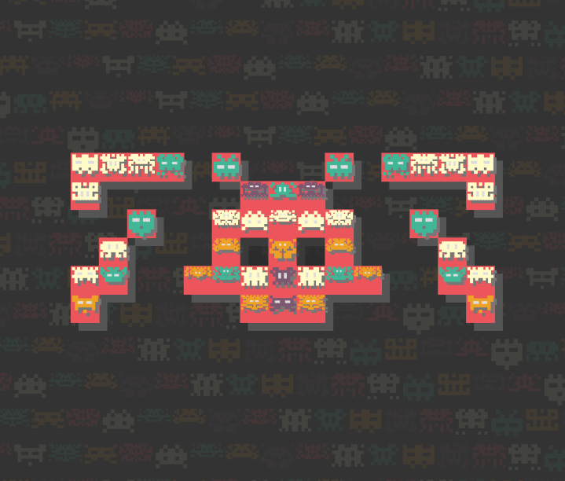

VADFAD
===

[](https://github.com/abetusk/iao/tree/main/vadfad)

(not) Available on [fxhash](https://www.fxhash.xyz/generative/slug/vadfad)

Quick Start
---

```
python3 -m http.server
```

```
chromium 'http://localhost:8000'
```

Short Statement
---

"VADFAD" is an experimental generative art piece that attempts to highlight some of the inherent contradictions surrounding the discussion of non-fungible tokens (NFTs) and its place as a vehicle for artistic creation, artistic expression and the potential of remuneration for artists.

p - pause

s - screenshot

To the extent possible, the source code is dedicated to the public domain (CC0) and can be used for any purpose, even commercial, by anyone. All third party libraries used are libre/free. Please check individual files for their respective licenses.

The price of this NFT tailored to be approximately $0.25 United States dollars (USD).  For the price of playing a typical 1980s video game arcade, anyone can mint this NFT.

The video game arcade industry helped create video game empires, drive the adoption of home video consoles and the use of personal computers.  NFTs have the potential to drive innovation in other markets that aren't well understood or explored yet.  

This work hopes to add to the conversation about examining the reality of the ecosystem that we've developed around digital goods and intellectual property.

Tags
---

minimal, generative, 8-bit, coin-op, arcade, 1980s, retro, video game, nostalgia, pfp

Statement
---

"VADFAD" is an experimental generative art piece that
attempts to highlight some of the inherent contradictions
surrounding the discussion of non-fungible tokens (NFTs) and
its place as a vehicle for artistic creation, artistic expression
and the potential of remuneration for artists.

To the extent possible, the source code is dedicated to the public
domain (CC0) and can be used for any purpose, even commercial, by anyone.
All third party libraries used are libre/free. Please check individual files for their respective licenses.

"VADFAD" attempts to address critiques against NFTs by highlighting their similarity
with cultural phenomena of the past.

In the United States, arcade video cabinets became popular and were popular for a younger audience.
The arcade games of the 1980s typically would cost $0.25 to play and offered anywhere from minutes
to hours of play, depending on the skill level of the player.
Many players spent hours feeding quarters into arcade games, attempting to increase their skill level
and get a high score that would be displayed to other, future players.

Though there is still a thriving arcade industry in other parts of the world, in the United States,
the arcade industry as it existed in the 1980s and 1990s was largely a fad, mostly disappearing with
the introduction of affordable home game systems and personal computers.

The price of this NFT tailored to be approximately $0.25 United States dollars (USD).
For the price of playing a typical 1980s video game arcade, anyone can mint this NFT.

Since all code for this NFT is released under a libre/free license, anyone who wants
to create their own NFT using this project as a template can do so.
If others have the desire to improve or experiment with other ideas, they can then
release their own NFT creating the potential for bragging rights, much like
getting a high score on a classic 1980s video game.

The video game arcade industry helped create video game empires, drive the adoption of home video
consoles and the use of personal computers.
NFTs have the potential to drive innovation in other markets that aren't well understood
or explored yet.

I don't know if "VADFAD"
is worth anything nor do I know if NFTs are
a worthwhile idea but perhaps we can start
to have a conversation that isn't a continuous
stream of incredulous dismissals and start to examine
the reality of the ecosystem that we've developed
around digital goods and intellectual property.

Reference
---

* [Invader Fractal by Jared S Tarbell](http://www.complexification.net/gallery/machines/invaderfractal/)

License
---

Third party libraries used are libre/free. Please check individual files for their respective licenses.

All other source code and other assets in this directory are, to the extent possible, licensed
under [CC0](https://creativecommons.org/publicdomain/zero/1.0/).

.
