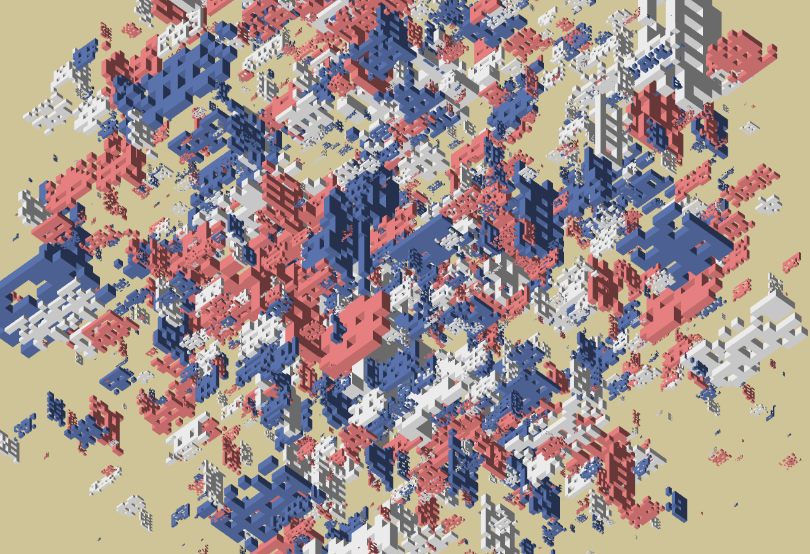

VADFAD : 2Gen
===


[](https://abetusk.github.io/iao/vadfad_2gen)

[Live](https://abetusk.github.io/iao/vadfad_2gen/)

(not) Available on [fxhash](https://www.fxhash.xyz/generative/slug/vadfad-:-2gen)

Quick Start
---

```
python3 -m http.server
```

```
chromium 'http://localhost:8000'
```

Short Statement
---

"VADFAD : 2Gen" is an experimental generative art piece that attempts to highlight some of the inherent contradictions surrounding the discussion of non-fungible tokens (NFTs) and its place as a vehicle for artistic creation, artistic expression and the potential of remuneration for artists.

s - Screenshot (PNG)

a - Animation (5s, webm) (advanced use)

To the extent possible, the source code is dedicated to the public domain (CC0) and can be used for any purpose, even commercial, by anyone. All third party libraries used are libre/free. Please check individual files for their respective licenses.

The hope is that the "VADFAD : 2Gen" NFT draws a parallel to other technological trends of the past and highlights how new technologies that are only just being understood, or experimented with, can have unforeseen benefits and whose enjoyment might seem obscure to an outside observer.

The video game arcade industry helped create video game empires, drive the adoption of home video consoles and advance the proliferation of personal computers. Just as video games of the past helped promote innovative new technologies, NFTs have the potential to drive innovation in other markets that aren't well understood or explored yet.

By combining a 1980s "8-bit" aesthetic, "VADFAD : 2Gen" tries to touch on the nostalgia for the arcade video game era of the 1980s while using a generative process to create almost surely unique 8-bit like monster scenes and creations. The combination of styles is done to try emphasize the similarity between the two eras, where the exuberance for the new technology, art and entertainment of the past has a similar spirit to the exhilaration of the present.

"VADFAD : 2Gen" is a continuation of "VADFAD" incorporating different compositions, color palettes and export options.

This work hopes to add to the conversation about examining the reality of the ecosystem that we've developed around digital goods and intellectual property.

This work takes inspiration from the artists `Jared Tarbell` and `Frederik Vanhoutte`.


Tags
---

minimal, generative, 8-bit, coin-op, arcade, 1980s, retro, video game, nostalgia, orthographic, three.js, voxel

Statement
---

"VADFAD : 2Gen" is an experimental generative art piece that
attempts to highlight some of the inherent contradictions
surrounding the discussion of non-fungible tokens (NFTs) and
its place as a vehicle for artistic creation, artistic expression
and the potential of remuneration for artists.

To the extent possible, the source code is dedicated to the public
domain (CC0) and can be used for any purpose, even commercial, by anyone.
All third party libraries used are libre/free. Please check individual files
for their respective licenses.

The hope is that the "VADFAD : 2Gen" NFT draws a parallel to other technological trends of the past and
highlights how new technologies that are only just being understood, or experimented with, can
have unforeseen benefits and whose enjoyment might seem obscure to an outside observer.

The video game arcade industry helped create video game empires, drive the adoption of home
video consoles and advance the proliferation of personal computers.
Just as video games of the past helped promote innovative new technologies, NFTs have
the potential to drive innovation in other markets that aren't well understood or explored yet.

I believe many people in the NFT space are acting in "good faith", helping fund artists,
driving innovation and willing to spend money for art and experiences that they enjoy,
just like people enjoying video game arcades of 1980s and 1990s.

By combining a 1980s "8-bit" aesthetic, "VADFAD : 2Gen" tries to touch on the nostalgia for the
arcade video game era of the 1980s while using a generative process to create almost surely
unique 8-bit like monster creations.
The combination of styles is done to try emphasize the similarity between the two eras,
where the exuberance for the new technology, art and entertainment of the past has a similar
spirit to the exhilaration of the present.

In addition, since all code is libre/free, artists and fans alike are encouraged to alter,
experiment and publish, even for commercial gain, ideas expressed in this NFT.
The license in the code used to create the art associated with this NFT allows for
further exploration, innovation and experimentation.

I don't know if "VADFAD : 2Gen"
is worth anything nor do I know if NFTs are
a worthwhile idea but perhaps we can start
to have a conversation that isn't a continuous
stream of incredulous dismissals and start to examine
the reality of the ecosystem that we've developed
around digital goods and intellectual property.

This work takes inspiration from the artist `Jared Tarbell`.


Reference
---

* [INVADER FRACTAL by Jared S Tarbell](http://www.complexification.net/gallery/machines/invaderfractal/)
* [Frederik Vanhoutte](https://twitter.com/wblut/status/1492632480079306756)

License
---

All third party libraries used are libre/free licensed.
Please see individual source files for their license information.

All other source code and other assets in this directory are, to the extent possible, licensed
under [CC0](https://creativecommons.org/publicdomain/zero/1.0/).

.
